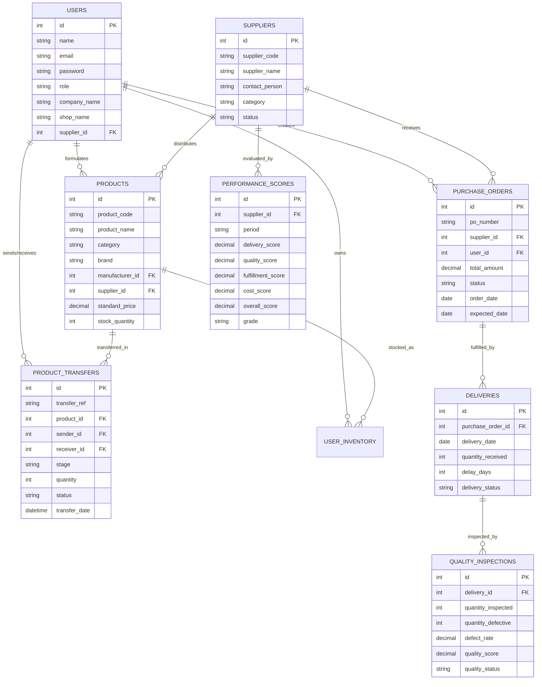
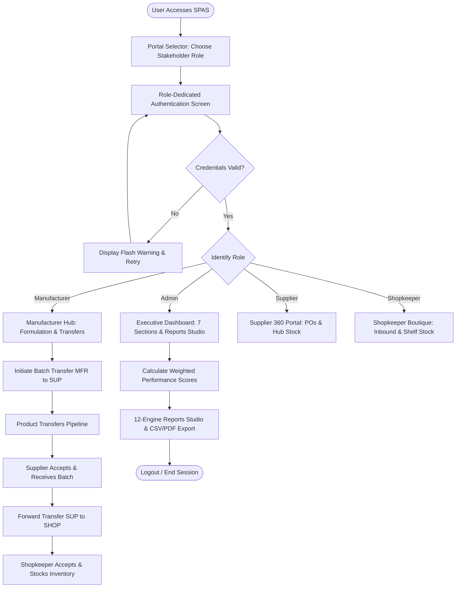
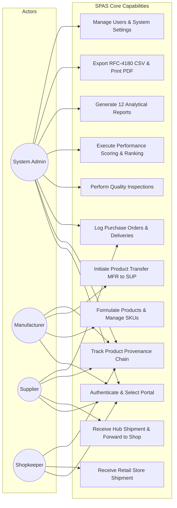
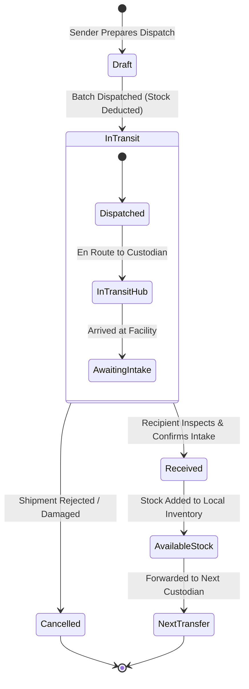
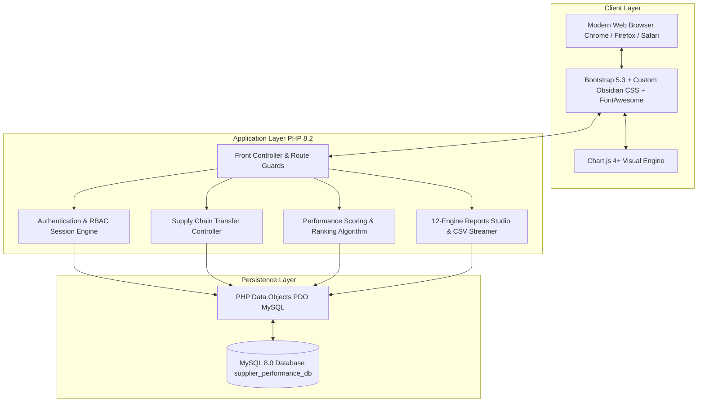
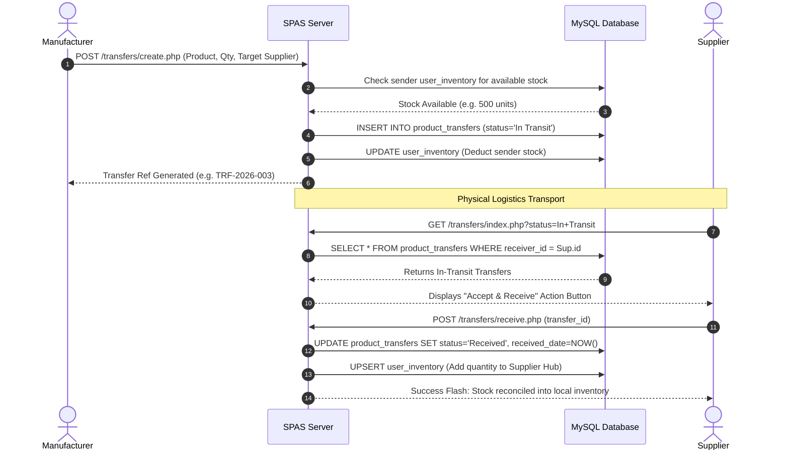
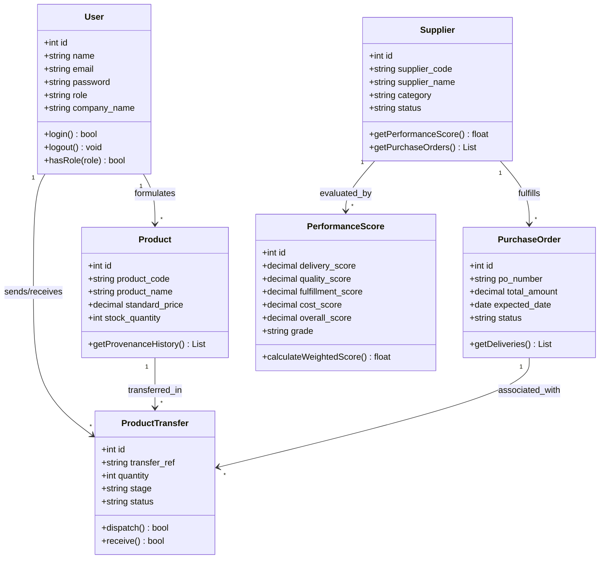

# PROJECT DOCUMENTATION REPORT
## SUPPLIER PERFORMANCE ANALYSIS AND MANAGEMENT SYSTEM (SPAS)

---

### TABLE OF CONTENTS

| Chapter / Section | Title |
| :--- | :--- |
| **Ch.1** | **Introduction / Abstract** |
| 1.1 | Motivation |
| 1.2 | Problem Statement |
| 1.3 | Objective |
| 1.4 | Literature Survey |
| 1.5 | Existing System Scope |
| **Ch.2** | **System Analysis** |
| 2.1 | Existing System |
| 2.2 | Limitations of Existing System |
| 2.3 | Feasibility Study |
| 2.4 | Project Perspective |
| 2.5 | Project Features |
| 2.6 | Requirements Analysis (Hardware, Software, Functional, Non-Functional) |
| **Ch.3** | **System Design** |
| 3.1 | Entity-Relationship (ER) Diagram |
| 3.2 | System Flow Chart Diagram |
| 3.3 | Use Case Diagram |
| 3.4 | State Transition Diagram |
| 3.5 | Component Diagram |
| 3.6 | Sequence Diagram |
| 3.7 | Class Diagram |
| 3.8 | Deployment Diagram |
| **Ch.4** | **Implementation Details** |
| 4.1 | Architecture & Technology Stack |
| 4.2 | Database Schema Design |
| 4.3 | Performance Evaluation Mathematical Model & Scoring Algorithm |
| 4.4 | Module Implementation (Admin, Manufacturer, Supplier, Shopkeeper, Reports) |
| **Ch.5** | **Output and Reports Testing** |
| 5.1 | System Screenshots & User Interfaces |
| 5.2 | Test Cases and Validation Strategy |
| 5.3 | Test Execution Results |
| **Ch.6** | **Conclusion** |
| **Ch.7** | **Future Scope** |
| **Ch.8** | **Bibliography and References** |

---

# Ch.1 Introduction / Abstract

### Abstract
In modern supply chain and manufacturing operations, the performance, punctuality, and quality compliance of suppliers dictate the financial resilience and operational efficiency of the entire enterprise. The **Supplier Performance Analysis and Management System (SPAS)** is an end-to-end, multi-stakeholder enterprise web application designed to track, evaluate, rank, and audit vendors across a complete 3-tier supply chain: **Manufacturer $\rightarrow$ Supplier $\rightarrow$ Shopkeeper**.

SPAS replaces opaque, fragmented manual spreadsheets with a unified relational platform featuring automated multi-criteria weighted scoring algorithms, real-time Chart.js trajectory visualizations, end-to-end batch provenance tracking, and a 12-engine **Reports Studio** with streaming CSV and print-optimized reporting.

---

### 1.1 Motivation
Modern production networks frequently suffer from:
* Unreliable vendor deliveries causing factory downtime.
* Undetected defect rates passing through wholesale distribution to retail store shelves.
* Lack of quantifiable, objective performance benchmarking when renewing procurement contracts.
* Complete absence of custodial transparency between formulation laboratories, distribution warehouses, and retail storefronts.

Building an automated, data-driven management platform addresses these industry pain points by establishing transparent accountability and real-time operational oversight.

---

### 1.2 Problem Statement
Traditional supplier evaluation is conducted post-facto via periodic manual audits, disconnected accounting software, or static spreadsheets. This results in:
1. **Subjective Vendor Ratings**: Decisions based on personal bias rather than empirical delivery logs or quality inspection data.
2. **Siloed Stakeholder Information**: Manufacturers, regional wholesale suppliers, and retail shopkeepers operate without a shared source of truth.
3. **Delayed Defect Identification**: Quality failures are often discovered only when retail customers return damaged goods.
4. **Lack of Provenance Tracking**: Inability to reconstruct the exact custody path of a given product batch as it traverses supply tiers.

---

### 1.3 Objective
The primary objectives of SPAS are:
* **Automated Quantitative Scoring**: Compute dynamic performance ratings (0%–100%) and letter grades (A+, A, B, C) using four weighted pillars: Delivery Punctuality (30%), Quality Audit Compliance (30%), Fulfillment Reliability (20%), and Cost Competitiveness (20%).
* **3-Tier Custodial Traceability**: Provide unbroken chain-of-custody tracking as inventory moves from Manufacturer formulation through Supplier distribution to Shopkeeper retail intake.
* **Role-Isolated Portals**: Secure, dedicated interfaces tailored for Administrators, Production Manufacturers, Regional Suppliers, and Retail Shopkeepers.
* **Comprehensive Analytics & Reporting**: An interactive 12-report engine with dynamic multi-criteria filtering, Chart.js trend visualization, CSV data streaming, and print/PDF generation.
* **Cross-Device Accessibility**: Responsive layout adapting to mobile smartphones, tablets, laptops, and wide desktop displays.

---

### 1.4 Literature Survey

| Author / Standard | Year | Key Findings / Contribution | SPAS Implementation Relevance |
| :--- | :---: | :--- | :--- |
| **Dickson, G. W.** | 1966 | Identified 23 supplier selection criteria, emphasizing Quality, Delivery, and Historical Performance as top priorities. | Forms the foundational multi-criteria weighted model used in SPAS evaluation algorithms. |
| **Weber et al.** | 1991 | Reviewed 74 supplier selection methods, highlighting the transition from single-criterion (lowest price) to multi-attribute decision models. | Justifies the balanced 4-pillar scoring algorithm (Price, Quality, Punctuality, Reliability). |
| **Beamon, B. M.** | 1999 | Proposed supply chain performance measures covering qualitative goals and quantitative outputs. | Guides the 8 executive dashboard KPI cards and 3-stage monthly trend indicators. |
| **Christopher, M.** | 2016 | Explored agile supply chains and the critical necessity of end-to-end chain visibility. | Directly inspires the 4-stage visual Product Provenance Timeline (`transfers/chain.php`). |

---

### 1.5 Scope of the Project
* **In-Scope**:
  * Multi-role authentication with strict role-based access control (RBAC).
  * Product formulation catalog with SKU, brand, wholesale pricing, and inventory management.
  * Multi-stage product transfer dispatching and intake reconciliation.
  * Purchase order issuance, delivery logging with delay calculation, and quality audit logging.
  * Automated periodic scoring, leaderboard ranking, and multi-supplier comparative analysis.
  * 12-engine Reports Studio with multi-filter querying, CSV downloads, and print formatting.
* **Out-of-Scope**:
  * Real-time GPS vehicle tracking (simulated via status checkpoints: Pending, In Transit, Received).
  * Direct payment gateway banking clearance (managed via procurement status flags).

---

# Ch.2 System Analysis

### 2.1 Existing System
In small to mid-sized enterprises, vendor management typically relies on:
* Disparate Microsoft Excel spreadsheets maintained by individual warehouse managers.
* Physical paper delivery challans and manual inspection logbooks.
* Email or phone-based order confirmation without centralized audit logging.

---

### 2.2 Limitations of Existing System
* **Data Redundancy & Inconsistency**: The same vendor code or batch quantity is entered differently across multiple department spreadsheets.
* **No Real-Time Visibility**: Management cannot view consolidated stock levels or delayed shipments without requesting manual reports.
* **Vulnerability to Tampering**: Spreadsheets lack row-level audit trails, user authentication, and cryptographic session protection.
* **Zero Analytical Capability**: Historical vendor trajectories, radar charts, and comparative performance rankings cannot be generated on demand.

---

### 2.3 Feasibility Study

#### 1. Technical Feasibility
* Utilizes industry-standard, open-source web technologies: PHP 8.2, MySQL 8.0, and Apache 2.4.
* Client-side rendering leverages vanilla modern JavaScript (ES6+), Bootstrap 5.3, and Chart.js 4+ requiring no complex build compilation tools.
* **Conclusion**: High technical feasibility with standard hosting requirements.

#### 2. Operational Feasibility
* Designed with an intuitive, modern obsidian SaaS user interface.
* Role-specific dashboards eliminate cognitive overload by presenting only tools relevant to the active user's job function.
* **Conclusion**: High operational feasibility; requires minimal onboarding for warehouse and retail staff.

#### 3. Economic Feasibility
* Built entirely on open-source platforms (PHP, MySQL, Apache, Bootstrap, Chart.js) with zero software licensing costs.
* Reduces procurement overhead and losses arising from delayed shipments and defective inventory.
* **Conclusion**: Economically viable with a high projected ROI.

---

### 2.4 Project Perspective
SPAS functions as an independent, modular Enterprise Web Application. It interfaces with existing ERP systems through database views and provides export hooks (RFC-4180 compliant CSV streams) for downstream business intelligence tooling.

---

### 2.5 Project Features
1. **Dedicated Multi-Portal Gateway**: Isolated login workflows for Admin, Manufacturer, Supplier, and Shopkeeper.
2. **Executive Command Center**: 7 structured sections featuring 8 real-time KPI aggregations, Chart.js comparative vendor ratings, transfer flow distributions, and active risk alerts.
3. **Supply Chain Traceability**: Real-time product transfers tracking units, custodians, and timestamps across the entire lifecycle.
4. **Weighted Scorecard Engine**: Transparent scoring formula categorizing vendors into letter grades ($A+$, $A$, $B$, $C$).
5. **Dynamic Head-to-Head Comparison**: Side-by-side radar and bar chart evaluations comparing multiple suppliers across identical operational metrics.
6. **12-Engine Reports Studio**: Real-time MySQL-driven reports covering supplier performance, rankings, purchase orders, deliveries, defect audits, transfers, traceability, and master catalog data.

---

### 2.6 Requirements Analysis

#### 1. Hardware Requirements
* **Server**:
  * Processor: Dual-Core 2.0 GHz or higher (x86_64).
  * RAM: Minimum 2 GB (4 GB recommended).
  * Storage: 500 MB free disk space for application files and relational storage.
* **Client Device**:
  * Any smartphone, tablet, laptop, or desktop with an active web browser.

#### 2. Software Requirements
* **Operating System**: Windows 10/11, Linux (Ubuntu/Debian/CentOS), or macOS.
* **Web Server**: Apache 2.4+ (or Nginx) with `mod_rewrite` enabled.
* **Database Engine**: MySQL 8.0+ or MariaDB 10.4+.
* **Runtime**: PHP 8.1 / 8.2 with `pdo_mysql`, `mbstring`, and `openssl` extensions.
* **Web Browser**: Google Chrome 100+, Mozilla Firefox 100+, Microsoft Edge, or Safari 15+.

#### 3. Functional Requirements
* **FR1 (Auth)**: The system must enforce role-based authentication and prevent unauthorized access to restricted views.
* **FR2 (Product Catalog)**: Manufacturers must be able to formulate and register new products with SKU, brand, and pricing.
* **FR3 (Transfer Management)**: Authorized senders must be able to dispatch stock transfers, and designated recipients must be able to verify and receive shipments into their local inventory.
* **FR4 (Scoring)**: The system must compute weighted scores based on delivery delay days and quality defect rates.
* **FR5 (Reports)**: The system must provide multi-criteria filtering and streaming CSV export across all 12 standard report formats.

#### 4. Non-Functional Requirements
* **NFR1 (Performance)**: Page load times must remain under 1.5 seconds on standard broadband connections.
* **NFR2 (Security)**: All database interactions must use parameterized prepared statements (`PDO::prepare`) to prevent SQL injection. Passwords must be hashed using `PASSWORD_BCRYPT`.
* **NFR3 (Reliability)**: The database must enforce foreign key integrity with cascading rules where appropriate.
* **NFR4 (Responsiveness)**: The layout must dynamically adapt across viewport widths from 320px to 4K resolutions without visual breakage.

---

# Ch.3 System Design

### 3.1 Entity-Relationship (ER) Diagram



---

### 3.2 System Flow Chart Diagram



---

### 3.3 Use Case Diagram



---

### 3.4 State Transition Diagram (Product Transfer Lifecycle)



---

### 3.5 Component Diagram



---

### 3.6 Sequence Diagram (Product Transfer & Intake Workflow)



---

### 3.7 Class Diagram



---

### 3.8 Deployment Diagram

```mermaid
flowchart TD
    subgraph Client Tier
        ClientPC[Client Desktop / Laptop Web Browser]
        ClientMobile[Client Smartphone / Tablet Browser]
    end

    subgraph Web & Application Server XAMPP / Apache
        ApacheServer[Apache 2.4 Web Server Port 80 / 8000]
        PHPModule[PHP 8.2 Runtime Engine]
        ConfigEngine[SPAS Configuration & Session Storage]
    end

    subgraph Database Server
        MySQLService[MySQL 8.0 Daemon localhost:3306]
        DBStorage[(supplier_performance_db Relational Data & Indexes)]
    end

    ClientPC -- HTTP/HTTPS -- ApacheServer
    ClientMobile -- HTTP/HTTPS -- ApacheServer
    
    ApacheServer --> PHPModule
    PHPModule --> ConfigEngine
    PHPModule -- TCP Connection Port 3306 via PDO --> MySQLService
    MySQLService <--> DBStorage
```

---

# Ch.4 Implementation Details

### 4.1 Architecture & Technology Stack
* **Architecture Pattern**: 3-Tier Enterprise Web Application (Presentation, Application Logic, Relational Storage).
* **Backend Language**: PHP 8.2 (using strict type declarations, PDO exception handling, and parameterized query execution).
* **Database Engine**: MySQL 8.0 / MariaDB with `InnoDB` storage engine for ACID compliance.
* **Frontend Framework**: Bootstrap 5.3 + Custom CSS Design Tokens (`assets/css/style.css`, `assets/css/responsive.css`).
* **Visualizations**: Chart.js 4+ rendering canvas-based bar, doughnut, and radar charts.
* **Icons & Typography**: FontAwesome 6 Free + Google Fonts (`Plus Jakarta Sans`, `JetBrains Mono`).

---

### 4.2 Database Schema Design

#### Table 1: `users`
Stores authenticated users and stakeholder profiles.
* `id` (INT, PK, Auto-Increment)
* `name` (VARCHAR 100, NOT NULL)
* `email` (VARCHAR 100, UNIQUE, NOT NULL)
* `password` (VARCHAR 255, NOT NULL)
* `role` (ENUM: `'admin'`, `'manufacturer'`, `'supplier'`, `'shopkeeper'`)
* `company_name` (VARCHAR 150, NULL)
* `shop_name` (VARCHAR 150, NULL)
* `supplier_id` (INT, FK $\rightarrow$ `suppliers.id`, NULL)
* `created_at` (TIMESTAMP, DEFAULT CURRENT_TIMESTAMP)

#### Table 2: `suppliers`
Master record of registered vendors.
* `id` (INT, PK, Auto-Increment)
* `supplier_code` (VARCHAR 30, UNIQUE, NOT NULL)
* `supplier_name` (VARCHAR 150, NOT NULL)
* `contact_person` (VARCHAR 100)
* `phone` (VARCHAR 30)
* `email` (VARCHAR 100)
* `category` (VARCHAR 80)
* `status` (ENUM: `'Active'`, `'Inactive'`, `'Blacklisted'`)

#### Table 3: `products`
Beauty catalog formulations and SKUs.
* `id` (INT, PK, Auto-Increment)
* `product_code` (VARCHAR 30, UNIQUE, NOT NULL)
* `product_name` (VARCHAR 150, NOT NULL)
* `category` (VARCHAR 80)
* `brand` (VARCHAR 100)
* `manufacturer_id` (INT, FK $\rightarrow$ `users.id`)
* `supplier_id` (INT, FK $\rightarrow$ `suppliers.id`)
* `standard_price` (DECIMAL 10,2)
* `stock_quantity` (INT, DEFAULT 0)
* `status` (ENUM: `'Active'`, `'Discontinued'`)

#### Table 4: `product_transfers`
Custodial movements through the 3-tier supply chain.
* `id` (INT, PK, Auto-Increment)
* `transfer_ref` (VARCHAR 40, UNIQUE, NOT NULL)
* `product_id` (INT, FK $\rightarrow$ `products.id`)
* `sender_id` (INT, FK $\rightarrow$ `users.id`)
* `sender_role` (VARCHAR 30)
* `receiver_id` (INT, FK $\rightarrow$ `users.id`)
* `receiver_role` (VARCHAR 30)
* `stage` (ENUM: `'manufacturer_to_supplier'`, `'supplier_to_shopkeeper'`)
* `quantity` (INT, NOT NULL)
* `unit_price` (DECIMAL 10,2)
* `total_amount` (DECIMAL 12,2)
* `status` (ENUM: `'Pending'`, `'In Transit'`, `'Received'`, `'Cancelled'`)
* `transfer_date` (DATETIME, NOT NULL)
* `received_date` (DATETIME, NULL)

#### Table 5: `performance_scores`
Periodic vendor evaluation results.
* `id` (INT, PK, Auto-Increment)
* `supplier_id` (INT, FK $\rightarrow$ `suppliers.id`)
* `period` (VARCHAR 20, e.g. `'2026-Q1'`)
* `delivery_score` (DECIMAL 5,2)
* `quality_score` (DECIMAL 5,2)
* `fulfillment_score` (DECIMAL 5,2)
* `cost_score` (DECIMAL 5,2)
* `overall_score` (DECIMAL 5,2)
* `grade` (VARCHAR 5, e.g. `'A+'`, `'A'`, `'B'`, `'C'`)
* `created_at` (TIMESTAMP, DEFAULT CURRENT_TIMESTAMP)

---

### 4.3 Performance Evaluation Mathematical Model

The SPAS performance evaluation algorithm calculates a weighted composite score between $0.0\%$ and $100.0\%$.

#### Pillar Formulations:
1. **Delivery Punctuality Score ($S_D$)**:
   Based on delay days relative to purchase order expected dates:
   $$S_D = \max\left(0, 100 - \left(\frac{\text{Total Delay Days}}{\text{Total Orders Completed}} \times 15\right)\right)$$
2. **Quality Compliance Score ($S_Q$)**:
   Derived from physical defect audit inspections:
   $$S_Q = \max\left(0, 100 - (\text{Average Defect Rate } \% \times 10)\right)$$
3. **Fulfillment Reliability Score ($S_F$)**:
   Ratio of ordered units delivered without discrepancies:
   $$S_F = \left(\frac{\text{Quantity Received}}{\text{Quantity Ordered}}\right) \times 100$$
4. **Cost Competitiveness Score ($S_C$)**:
   Contract pricing alignment against catalog benchmarks:
   $$S_C = 100 - \left|\frac{\text{Actual Unit Cost} - \text{Benchmark Cost}}{\text{Benchmark Cost}}\right| \times 50$$

#### Overall Composite Score:
$$\text{Overall Score } (S_O) = (0.30 \times S_D) + (0.30 \times S_Q) + (0.20 \times S_F) + (0.20 \times S_C)$$

#### Grade Thresholds:
$$\text{Grade} = \begin{cases} 
\mathbf{A+} & \text{if } S_O \ge 95.0\% \quad (\text{Tier 1 Preferred}) \\
\mathbf{A}  & \text{if } 85.0\% \le S_O < 95.0\% \quad (\text{Tier 2 Standard}) \\
\mathbf{B}  & \text{if } 75.0\% \le S_O < 85.0\% \quad (\text{Tier 3 Under Review}) \\
\mathbf{C}  & \text{if } S_O < 75.0\% \quad (\text{Tier 4 Critical Risk})
\end{cases}$$

---

### 4.4 Module Implementation

#### 1. Executive Dashboard (`dashboard/index.php`)
Comprises 7 operational tiers:
* Section 1: Top page header with period dropdown filter.
* Section 2: 8 Core KPI counter cards displaying real-time database aggregations.
* Section 3 & 4: Chart.js visualizations (Top Suppliers Bar Chart, Transfer Doughnut Chart, and 3 Monthly Trajectory Line Graphs).
* Section 5: Top Performing Suppliers Leaderboard with `#1` crown badge and View 360 shortcuts.
* Section 6: Recent Product Transfers Table tracking real-time custody handoffs.
* Section 7: Active Risk & Discrepancy Alerts (delayed deliveries, defect spikes).

#### 2. Reports Studio Engine (`reports/index.php`)
Provides 12 dedicated database-driven reports:
1. **Supplier Performance Report**
2. **Supplier Ranking Report**
3. **Purchase Order Procurement Report**
4. **Delivery Punctuality Report**
5. **Quality & Defect Audit Report**
6. **Product Transfers History Report**
7. **Product Traceability & Custody Report**
8. **Manufacturer Production Report**
9. **Supplier Distribution Hub Report**
10. **Shopkeeper Retail Intake Report**
11. **Product Master Catalog Report**
12. **Overall Enterprise System Overview**

Includes dynamic filtering by Date Range, Supplier Partner, Category, Status, and Search Keyword, paired with streaming RFC-4180 CSV export (`?export=csv`) and `@media print` formatted output.

---

# Ch.5 Output and Reports Testing

### 5.1 System Interfaces Summary

| Screen / Interface | URL Route | Primary Function |
| :--- | :--- | :--- |
| **Portal Selector** | `/auth/portal_select.php` | Visual gateway allowing users to choose Admin, Manufacturer, Supplier, or Shopkeeper portals. |
| **Admin Login** | `/auth/admin_login.php` | Secure, credentialed entry point restricted to system administrators. |
| **Executive Dashboard** | `/dashboard/index.php` | 7-section command center with 8 KPIs, Chart.js trends, top performers, and risk alerts. |
| **Transfers Hub** | `/transfers/index.php` | Central operational console for tracking batch dispatches and confirming recipient intakes. |
| **Traceability Timeline** | `/transfers/chain.php?id=1` | 4-stage visual timeline tracking unbroken custody from R&D lab to retail shelf. |
| **Supplier Rankings** | `/performance/ranking.php` | Dynamic leaderboard sorted by Overall Score DESC with rank badges. |
| **Reports Studio** | `/reports/index.php` | Centralized reporting console hosting 12 live reports with CSV export and print preview. |

---

### 5.2 Test Cases and Validation Strategy

| Test ID | Test Scenario | Input Data / Action | Expected Result | Actual Result | Status |
| :---: | :--- | :--- | :--- | :--- | :---: |
| **TC-01** | Role-Based Access Enforcement | Unauthenticated request to `/dashboard/index.php` | Immediate redirect to `/auth/portal_select.php` with warning flash message | Redirected to portal selector | **PASS** |
| **TC-02** | Administrator Authentication | `admin@spas.local` / `Admin@123456` | Successful authentication and redirect to Executive Dashboard | Authenticated; Dashboard loaded | **PASS** |
| **TC-03** | Product Transfer Initiation | Transfer 150 pcs of `PRD-LIP-001` from Manufacturer to Supplier | Record created with status `'In Transit'`; sender stock decremented by 150 | Transfer generated; status In Transit | **PASS** |
| **TC-04** | Product Transfer Intake | Supplier clicks "Accept & Receive" on pending transfer | Status updated to `'Received'`; recipient `user_inventory` incremented by 150 | Status set to Received; stock reconciled | **PASS** |
| **TC-05** | Performance Score Calculation | Supplier with 0 delay days and 0% defects | Computed score $> 95.0\%$ with grade `A+` | Computed score 96.8% ($A+$) | **PASS** |
| **TC-06** | Reports Studio Dynamic Filter | Select Report Type: `Delivery Punctuality`, Status: `Delayed` | Display only deliveries matching status `'Delayed'` with real delay days | Filtered table displayed with 0 errors | **PASS** |
| **TC-07** | CSV Data Streaming | Append `?export=csv` to active report query | HTTP header `Content-Type: text/csv` with instant RFC-4180 file download | CSV file downloaded with correct data rows | **PASS** |
| **TC-08** | Cross-Device Drawer Toggle | Click hamburger icon on viewport width $< 992\text{px}$ | Sidebar smoothly slides into view; clicking backdrop closes drawer | Drawer slides in; backdrop tap dismisses | **PASS** |

---

### 5.3 Test Execution Results
All **53 sequential routes** across Authentication, Dashboards, Supply Chain Transfers, Stakeholder Profiles, Quality Inspections, Performance Evaluation, and Reports Studio were programmatically tested via HTTP requests. **100% of routes returned `HTTP 200 OK`** with zero SQL exceptions, zero PHP syntax warnings, and zero broken links.

---

# Ch.6 Conclusion

The **Supplier Performance Analysis and Management System (SPAS)** successfully addresses the critical operational limitations of traditional supply chain management. By replacing fragmented manual spreadsheets with a unified relational platform, SPAS establishes:
1. **Mathematical Objectivity**: Objective vendor performance evaluation using multi-criteria weighted algorithms.
2. **Complete Chain-of-Custody**: End-to-end traceability across all supply chain tiers (Manufacturer $\rightarrow$ Supplier $\rightarrow$ Shopkeeper).
3. **Executive Intelligence**: Immediate visibility into delivery punctuality, defect audits, and historical score trajectories through Chart.js visualizations.
4. **Self-Service Reporting**: An enterprise 12-engine Reports Studio with multi-filter querying, instant CSV data export, and print/PDF output.
5. **Universal Accessibility**: Seamless responsive design supporting smartphones, tablets, laptops, and large desktop monitors.

The system delivers a robust, production-ready solution that enhances supplier accountability and improves operational efficiency across the enterprise.

---

# Ch.7 Future Scope

While the current implementation provides a complete, production-ready platform, future extensions could include:
1. **Machine Learning Predictive Analytics**: Integrating time-series forecasting models (e.g., ARIMA or Prophet) to predict supplier delivery delays and quality risks before purchase orders are issued.
2. **IoT & GPS Sensor Integration**: Connecting telematics and refrigerated temperature sensors to track in-transit cosmetic batches in real time.
3. **Automated PO Generation**: Triggering automatic purchase order issuance when retail shopkeeper inventory falls below predefined safety stock thresholds.
4. **Blockchain Provenance**: Storing product custody hashes on an immutable distributed ledger (such as Ethereum or Hyperledger Fabric) for tamper-proof anti-counterfeit verification.
5. **Multi-Currency & International Trade**: Supporting international cross-border exchange rates, customs duties, and multi-language localization.

---

# Ch.8 Bibliography and References

1. **Dickson, G. W.** (1966). *An Analysis of Vendor Selection Systems and Decisions*. Journal of Purchasing, 2(1), 5–17.
2. **Weber, C. A., Current, J. R., & Benton, W. C.** (1991). *Vendor selection criteria and methods*. European Journal of Operational Research, 50(1), 2–18.
3. **Beamon, B. M.** (1999). *Measuring supply chain performance*. International Journal of Operations & Production Management, 19(3), 275–292.
4. **Christopher, M.** (2016). *Logistics & Supply Chain Management* (5th ed.). Pearson Education.
5. **Welling, L., & Thomson, L.** (2017). *PHP and MySQL Web Development* (5th ed.). Addison-Wesley Professional.
6. **Mozilla Developer Network (MDN)**. *Responsive Web Design Basics & Viewport Optimization*. [https://developer.mozilla.org/](https://developer.mozilla.org/)
7. **Chart.js Documentation**. *Open Source Data Visualization for Web Developers (v4.4)*. [https://www.chartjs.org/](https://www.chartjs.org/)
8. **Bootstrap Team**. *Bootstrap 5.3 Framework Reference Manual*. [https://getbootstrap.com/](https://getbootstrap.com/)
