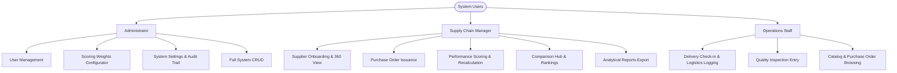
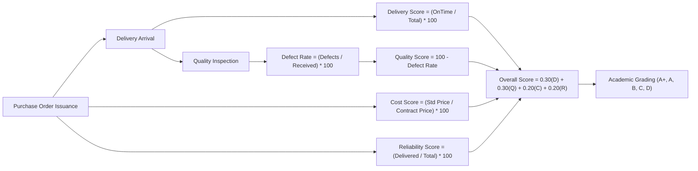
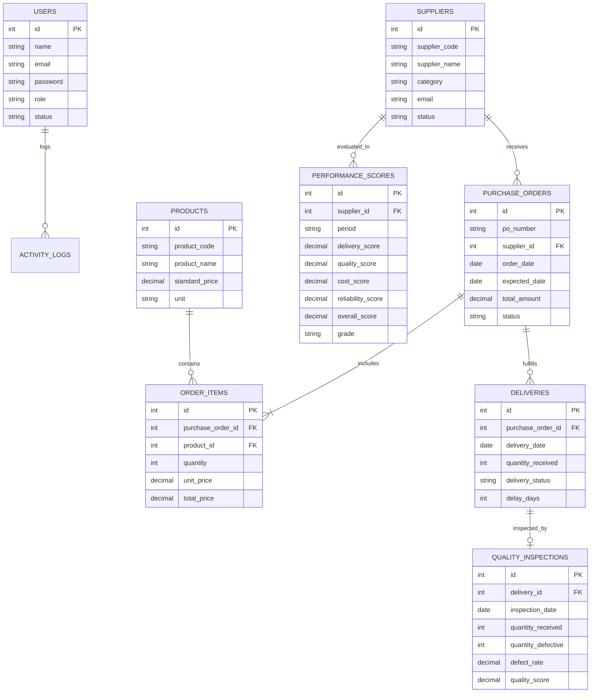

# PROJECT DESIGN REPORT (PDR)
## Supplier Performance Analysis and Management System (SPAS)
**Academic Final-Year B.Sc. Computer Science Capstone Project**

---

### 1. Executive Summary & Problem Definition
In contemporary supply chain operations, organizations frequently struggle with inconsistent vendor performance, logistics delivery delays, component defects, and cost overruns. Traditional supplier management often relies on manual spreadsheets or disconnected point solutions lacking unified mathematical scoring and automated decision support.

The **Supplier Performance Analysis and Management System (SPAS)** resolves these challenges by providing a centralized web-based platform that tracks procurement transactions, computes operational metrics using multi-criteria weighted scoring algorithms, and delivers visual analytics to enable strategic vendor decisions.

---

### 2. System Objectives
1. **Automate Supplier Evaluation**: Replace subjective reviews with quantifiable mathematical models based on Delivery (30%), Quality (30%), Cost (20%), and Reliability (20%).
2. **Logistics Tracking & Delay Computation**: Automatically determine shipment transit delays by comparing expected delivery schedules against actual arrival dates.
3. **Quality Assurance & Defect Rate Auditing**: Systematically compute non-conformance percentages and quality scores for all incoming goods.
4. **Interactive Corporate Dashboard**: Deliver executive-level Chart.js visualizers, KPI summaries, and automated risk alert feeds.
5. **Role-Based Access & Security**: Provide strict access levels (Admin, Manager, Staff) with full audit logging and data integrity safeguards.

---

### 3. User Personas & Role-Based Responsibilities

---

### 4. Mathematical Modeling & Algorithmic Design

#### Detailed Mathematical Definitions:
1. **Delivery Punctuality ($S_{\text{delivery}}$)**:
   $$S_{\text{delivery}} = \left( \frac{N_{\text{on-time}}}{N_{\text{total deliveries}}} \right) \times 100$$
2. **Quality Compliance ($S_{\text{quality}}$)**:
   $$\text{Defect Rate} = \left( \frac{Q_{\text{defective}}}{Q_{\text{received}}} \right) \times 100$$
   $$S_{\text{quality}} = 100 - \text{Defect Rate}$$
3. **Cost Competitiveness ($S_{\text{cost}}$)**:
   $$S_{\text{cost}} = \min\left(100, \left( \frac{P_{\text{standard benchmark}}}{P_{\text{supplier price}}} \right) \times 100\right)$$
4. **Fulfillment Reliability ($S_{\text{reliability}}$)**:
   $$S_{\text{reliability}} = \left( \frac{N_{\text{completed POs}}}{N_{\text{total POs}}} \right) \times 100$$
5. **Weighted Overall Score ($S_{\text{overall}}$)**:
   $$S_{\text{overall}} = (w_d \cdot S_{\text{delivery}}) + (w_q \cdot S_{\text{quality}}) + (w_c \cdot S_{\text{cost}}) + (w_r \cdot S_{\text{reliability}})$$
   $$\text{where } w_d + w_q + w_c + w_r = 1.00$$

---

### 5. Relational Database Entity-Relationship (ER) Architecture

---

### 6. Functional & Non-Functional Requirements Matrix

| Requirement ID | Type | Description | Implementation Mechanism |
| :--- | :--- | :--- | :--- |
| **FR-01** | Functional | User authentication & role enforcement | PHP Sessions, `password_verify()`, `require_role()` |
| **FR-02** | Functional | Dynamic purchase order generation | JavaScript multi-row cloner, SQL transaction |
| **FR-03** | Functional | Real-time delay days calculation | `strtotime()` difference engine + live DOM listeners |
| **FR-04** | Functional | Automated defect rate calculation | Division-safe algebra engine + bounds checking |
| **FR-05** | Functional | Multi-supplier head-to-head comparison | Overlaid Chart.js radar charts & matrix table |
| **FR-06** | Functional | CSV report exports | Streamed HTTP attachment with `fputcsv()` |
| **NFR-01** | Non-Functional | Security against SQL injection | 100% Parameterized PDO prepared statements |
| **NFR-02** | Non-Functional | Security against CSRF | One-time random token generation & verification |
| **NFR-03** | Non-Functional | Responsiveness | Bootstrap 5 grid + mobile slide drawer |
| **NFR-04** | Non-Functional | Performance | Indexed foreign keys & indexed search columns |

---

### 7. Academic Conclusion
The Supplier Performance Analysis and Management System successfully demonstrates the application of computer science principles—including relational database normalization, modular software architecture, algorithmic modeling, and human-computer interface (HCI) design—to solve real-world industrial supply chain challenges.
